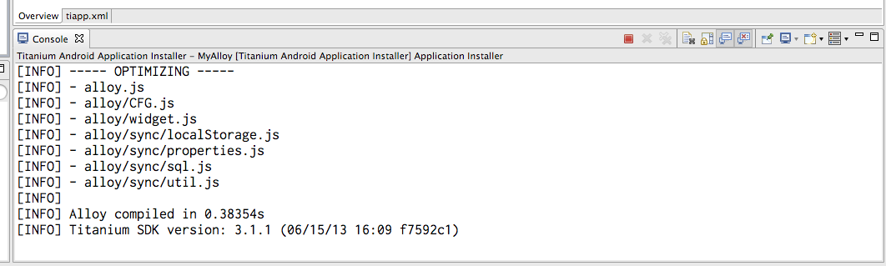

# 初心者でも簡単に使えるフレームワーク『Alloy』で作るアプリ講座

ChatWork 株式会社 技術部 モバイルチームエンジニア 宮下 竜大郎

## はじめに

Titanium Mobile は JavaScript を使って iOS や Android のアプリを作ることができる開発環境です。 Objective-C や Java を使わなくても本格的なアプリを、しかも iOS も Android も同時に開発できる Titanium は自分の頭の中にあるアイデアを形にするための大変強力な武器になります。一方で、ユーザーインターフェイスやロジックなど、全てを JavaScript で書かなければならないためにとても入り組んだプログラムコードになりがちでした。

この問題に対応するため、 Titanium の開発元である Appcelerator Inc. が開発したもの、それが「**Alloy (アロイ)**」です。 Alloy を使うことで HTML / CSS / JavaScript でウェブサイトを作るように Titanium を使ったアプリ開発を行うことができるようになります。

## Alloy とは

Alloy は Titanium 用の MVC フレームワークです。

* ロジックとデータの固まりである、**モデル**
* 操作できるユーザーインターフェイスである、**ビュー**
* ユーザーの操作とロジックをつなぐための、**コントローラー**

プログラムをこれらの役割に分解して、キッチリと書き分けるためのお手伝いをしてくれるものです。 Alloy を実際に使うとこれらは

* ロジックを書くための、モデル専用の JavaScript ファイル
* XML と TSS (Titanium Style Sheet) で書かれた UI
* UI からの操作を受け付ける、コントローラー専用の JavaScript ファイル

として書き分けることができるようになります。役割分担がしっかりと行われるので、コードを書くときにも、直すときにも分かりやすく、素早く行えるようになるでしょう。今回の講座ではこの Alloy の美味しいところであるビューとコントローラーの分解に着目して、ビルトインのアニメーション効果や、実際のアプリケーション構築を行います。

## 初めての Alloy

### Alloy を使った Titanium アプリプロジェクトを作る

Alloy を使った Titanium アプリ開発は Titanium Studio から始めることができます。 Titanium Studio の File → New → Mobile Project と進んでください。 Mobile Module Project と間違えやすいので注意してください。


Mobile Project を選択すると New Mobile Project のウィンドウが開きます。ウィンドウの左側には Alloy と Classic と表示されています。ここでは Alloy を選択してください。 Alloy を選択すると Default Alloy Project と Two-tabbed Alloy Application の2つの項目が表示されています。ここでは Default Alloy Project を選択してください。


Default Alloy Project を選択して、画面下にある Next > を押します。 Next > を押すとプロジェクトの詳細設定を行う画面に移ります。この詳細設定で必要な項目は Project name と App Id の2つです。ここでは、

* Project name : **MyAlloy**
* App Id : **com.example.myalloy**

と入力してください。


Titanium SDK Version は 3.1.1.GA または 3.1.2.GA を選択してください。また、 Deployment Targets はチェックが入っているものがあれば、そのままにしてください。 Cloud-enable this application のチェックは外してください。 Project name と App Id を入力すると画面右下の Finish ボタンが押せるようになりますので、 Finish を押してプロジェクトの作成を完了してください。

プロジェクトの作成を完了すると Titanium Studio は index.xml と TiApp Editor という2つのタブが開いた状態になります。また、左側のサイドバーでは作った MyAlloy プロジェクトが選択された状態になっているはずです。


これで Alloy を使った Titanium アプリプロジェクトの作成は完了です。 Alloy を使う場合も使わない場合も、 Titanium Studio から簡単に新しいアプリプロジェクトを立ち上げることが確認できました。

### Alloy アプリを動かしてみよう

プロジェクトができたら早速 Alloy アプリを立ち上げてみましょう。 Mac を使っていて Xcode のインストールや iOS シミュレータの設定が済んでいる方は iPhone Simulator を選択してください。 Windows を使っていて Android 2.3 以上の実機を持っている方は Android Device を、実機を持っていない方は Android Emulator を選択してください。


項目の選択を行うと、 Titanium Studio に Console という項目が現れ、アプリのビルドが始まります。アプリのビルドに成功すると選択した項目に応じて自動的に iPhone Simulator や Android Emulator が立ち上がり、 Alloy アプリが起動します。



iPhone Simulator や Android Emulator / 実機で動作させてみると、白い画面の真ん中に Hello, World と書かれた画面が現れます。おめでとうございます！これがあなたの初 Alloy アプリです。なんの変哲も無いアプリですが、 Hello, World と書かれた文字を1度ポンとタップしてみてください。 Hello, World と書かれた小さなウィンドウが前に飛び出してくるはずです。

<table>
    <tr>
        <td><br>Android で動かした場合の画面</td>
        <td><br>iPhone Simulator で動かした場合の画面</td>
    </tr>
</table>

### Alloy アプリを紐解いてみよう

ここからは Alloy アプリの中身に踏み込んでいきます。 Titanium Studio の左側のサイドバーを見てみましょう。 ▶ app と書かれている場所がありますので、これをダブルクリックして展開してみてください。 ▼ app という項目になり、下にずらりと様々な項目が表示されたはずです。さらに controllers / styles / views をダブルクリックして展開してみましょう。


展開してみると、 controllers/index.js, styles/index.tss, views/index.xml というものがあります。 Alloy は controllers / styles / views にそれぞれ同じファイル名を持つものを、関係があるファイルとして取り扱います。また、 **index.〜** は Alloy アプリを立ち上げたときに一番最初に使われる特別なファイルです。

**index.xml** は一番始めに表示される画面の UI の構造を決めるためのファイルです。この中では HTML のようにタグを使ってユーザーインターフェイスを作ることができます。 Web サイトでいうところの index.html に相当します。

```xml
<Alloy>
  <Window class="container">
    <Label id="label" onClick="doClick">Hello, World</Label>
  </Window>
</Alloy>
```

**index.tss** は index.xml で構築した UI の装飾を行うためのファイルです。この中では XML ファイルに書いた ID や Class 、またはタグに従って文字の色や背景色、大きさなどを指定することができます。 Web サイトでいうところの CSS に相当します。

```json
".container": {
  backgroundColor:"white"
},
"Label": {
  width: Ti.UI.SIZE,
  height: Ti.UI.SIZE,
  color: "#000"
} 
```

**index.js** は index.xml で構築した UI を操作したときに行いたい処理を書くためのファイルです。この中では XML ファイルに書いたイベント名と関数名に従って、処理の固まりである関数の本体を書く事になります。 Web サイトでいうところの JavaScript に相当します。

```javascript
function doClick(e) {
    alert($.label.text);
}

$.index.open();
```

それぞれの関係を見てみましょう。 index.xml を見てみると、 Alloy というタグが頭にあり、その中では Window > Label と続いています。 Window には container というクラスが付けられていて、 Label には label という ID と doClick という名前で **onClick 属性**が付けられています。この中で注目するべき点は、

* クラス
* ID
* 属性

の3つです。**クラス**は主に TSS で装飾を行うために使います。 index.tss を見てみましょう。 `".container": {` という項目があります。ダブルクオーテーションで囲われていて、初めが **.** で始まるように記述すると、 TSS の中では「このクラス名を持つものの見た目をこうする」という指定になります。 index.tss 中では「**クラス container を持つものは背景色を白にする**」という意味を持っています。

**ID** は主にコントローラ JavaScript で要素が持つ属性に JavaScript 中から触るために使います。 index.js を見てみましょう。 `alert($.label.text);` という項目があります。 $ は対応する XML を参照するために用意されている特別な名前です。次に .label と続きます。これは「**対応する XML の ID "label" を持つ要素を示せ**」という命令になります。最後に .text ですが、これは index.xml 中で Label タグで囲われている文字列「Hello, World」を指し示しています。正直なところ、あまり良い例ではありません。 index.xml の Label タグで書かれている場所は、

```xml
<Label id="label" onClick="doClick" text="Hello, World" />
```

と書かれているのと同じだと思ってください。実際、このように書き換えた場合でも全く同じように動作します。

**属性**はいくつかの意味を持っています。 ID の説明で XML を書き換えた場合の例を説明しました。この中で `text="Hello, World"` という項目が現れました。これは「**Label タグに付けられた text 属性の値は Hello, World**」という意味を持っています。アプリを立ち上げてみて分かったと思いますが、 text 属性の値「Hello, World」が画面にそのまま表示されていましたね？

一方で、 `id="label" onClick="doClick"` を見てみましょう。これらは画面のどこにも表示されませんでした。しかし、 id 属性は index.js の中でこの Label 要素に触れるために付けられた名前だということは先ほど説明しました。では onClick 属性はどうでしょうか？ onClick 属性の値は doClick という文字です。これを index.js で探してみると、

```javascript
function doClick(e) {
    alert($.label.text);
}
```

という関数が見つかりました。これは「**onClick 属性はこの要素はクリックができる。クリックしたら doClick という名前を持つ関数を実行せよ**」という意味を持っています。このとき、 onClick のことを「**イベントハンドラ**」と呼びます。このように属性には

1. UI の一部として画面に表示させるもの
2. コントローラの JavaScript から参照させるためにつけるもの
3. UI を操作するための操作の種類と、操作したときに実行したい関数の名前のセット

という複数の意味があります。見た目のための属性もありますが、それらはクラスにして TSS の中で書いてあげると良いでしょう。

## Alloy の美味しいところ

Alloy の紐解きはこれぐらいにして、 Alloy の美味しいところを味わっていきます。

### アニメーション

Alloy にはビルトインアニメーションという機能が備わっています。フェードインやフェードアウト、クロスフェードやポップインなどのアニメーション効果がいくつも最初から使えるようになっているのです。早速見てみましょう。

[http://docs.appcelerator.com/titanium/latest/#!/api/Alloy.builtins.animation](http://docs.appcelerator.com/titanium/latest/#!/api/Alloy.builtins.animation)<br>どのようなアニメーションが使えるのかは、 Titanium の公式ドキュメントを見ると分かります。ここでは先ほど作った MyAlloy アプリの Label をクリックしたら点滅させるようにしてみましょう。ドキュメントを見てみると、例として

```javascript
var animation = require('alloy/animation');
animation.crossFade(view1, view2, 500, finishCallback);
```

というコードが載っています。これを参考にします。 index.js の doClick 関数を以下のように書き換えます。

```javascript
function doClick(e) {
    var animation = require('alloy/animation');
    animation.flash($.label);
}
```

とてもシンプルですね。クリックしたら $.label … つまり、 index.xml の ID "label" が付けられた要素を点滅させる … ということです。他のアニメーションも試してみましょう。次にアプリを立ち上げたら、画像をフェードアウトさせてみましょう。

まずは index.xml を次のように変更します。

```xml
<Alloy>
  <Window class="container" onOpen="doOpen">
    <ImageView image="http://placehold.jp/150x150.png" id="image" />
  </Window>
</Alloy>
```

新しい要素が現れました。まず、 Window に **onOpen** という属性が付けられました。値は doOpen です。これは「**Window が開かれたら doOpen という関数を実行せよ**」という命令になります。先ほどは Label に onClick というものを使っていました。 Alloy ではこのような形で「**〇〇をしたら△△という関数を実行せよ**」という属性は原則として **onHoge** という形で書きます。

次に現れた新しい要素は **ImageView** です。これは画像を表示するためのものです。 Titanium には他にも様々なビューが用意されています。これは後ほど紹介しますが、 ImageView は image 属性に画像へのパスまたは URL を渡すと表示させることができます。

次に index.js を修正します。

```javascript
function doOpen() {
    var animation = require('alloy/animation');
    animation.fadeOut($.image, 1500);
}

$.index.open();
```

先ほどまでは doClick という関数がありましたが、これが doOpen になりました。この関数が Window が開いたとき = アプリが起動したときに呼ばれます。中では $.image … 先ほどの ImageView を 1500 [ms] かけてフェードアウトする命令が書かれています。

<table>
    <tr>
        <td><br>Android で動かした場合の画面</td>
        <td><br>iPhone Simulator で動かした場合の画面</td>
    </tr>
</table>

### 日付の計算

Twitter クライアントや Facebook クライアントのようなものを作りたいと思ったとき、ユーザーの投稿が現在時刻からどれぐらい前のものなのかを表示させたいと思うことがあります。そしていざ日付の計算や表示をさせたいと思うと、これがまた面倒くさい作業が必要になります。 JavaScript のライブラリには日付計算用として有名な「[Moment.js](http://momentjs.com/)」というものがあります。 Alloy ではこのライブラリがビルトインされていて、簡単に使うことができます。

まずは日付を表示するための Label を用意してみましょう。

```xml
<Alloy>
  <Window class="container" onOpen="doOpen">
    <ImageView image="http://placehold.jp/150x150.png" id="image" />
    <Label id="clock" />
  </Window>
</Alloy>
```

Label が置かれました。しかし、 id 属性しか付けられておらず、 text 属性はありません。 Window の onOpen でこの Label に日付の文字列を表示させてみましょう。ただ表示させるだけでは面白くないので、画像がフェードアウトし終わったら表示させてみます。

```javascript
function doOpen() {
    // 画像をフェードアウトする
    var animation = require('alloy/animation');
    animation.fadeOut($.image, 1500, function() {
        // 画像が消えた日付を表示する
        var moment = require('alloy/moment');
        $.clock.text = moment().format('MMMM Do YYYY, h:mm:ss a');
    });
}

$.index.open();
```

少しプログラムが複雑になりました。先ほどと異なる点は fadeOut の引数の3つめにコールバック関数が指定されたところです。これは、 fadeOut メソッドの仕様で、3つめに「フェードアウトが終わった後に行いたい処理」を書く事ができます。そしてその中で Moment.js を使っています。

`$.clock.text = ` というこれまでに無い書き方が登場しました。先ほどまでは $.label.text のように参照するだけでしたが、実際には = を使って代入を行うこともできます。 XML 中の Label には text 属性を付けませんでしたが、このような形でコントローラの中で後付けすることもできます。もう少し改良して、日付の計算をしてみましょう。アプリを初めて立ち上げた日を例えば 2013年8月1日として、それからどれぐらい経過しているのかを表示させてみたいと思います。

```javascript
function doOpen() {
    // 画像をフェードアウトする
    var animation = require('alloy/animation');
    animation.fadeOut($.image, 1500, function() {
        // アプリを初めて起動してからどれぐらい経過したのかを表示する
        var moment = require('alloy/moment');
        $.clock.text = moment('20130801', 'YYYYMMDD').fromNow();
    });
}

$.index.open();
```

とても分かりやすいですね。 20130801 から fromNow メソッドでどれぐらい経過しているのかを簡単に計算することができました。もしも Moment.js が無かったら、もっと複雑な計算をずらずらと書かなければいけません。 Alloy にはこのような便利で強力なライブラリが最初から同梱されているので、作りたいと思っているアプリを素早く形にすることができます。

<table>
    <tr>
        <td><br>Android で動かした場合の画面 (2013/08/12 時点)</td>
        <td><br>iPhone Simulator で動かした場合の画面 (2013/08/12 時点)</td>
    </tr>
</table>

## 課題：自己紹介アプリを作ってみよう

Alloy を使って自己紹介アプリを作ってみましょう。カメラや画面遷移、ウェブからの情報取得などが盛り込まれています。自己紹介アプリを作るために新しい Default Alloy Project を以下の情報で作ってください。

* Project name : **My Profile**
* App Id : **com.example.myprofile**

今回開発を目指すアプリの形は、

<table>
    <tr>
        <td><br>Android で動かした場合の画面</td>
        <td><br>iPhone Simulator で動かした場合の画面</td>
    </tr>
</table>

このような形になります。機能は、

1. 画像を長押しすると写真を撮影するか、ギャラリーから写真を選んでアイコンとして表示できる
2. 画像と名前が表示されている欄を横にスワイプすると、プロフィールが表示される
3. TableView を使ってソーシャルメディアの赤宇土を表示できる
4. テーブルの各行をクリックするとウィンドウが開いて、各 SNS のプロフィール画面に飛ぶ

というものです。<br>[https://github.com/ryugoo/AlloyProfile](https://github.com/ryugoo/AlloyProfile)<br>こちらでソースコードは全て公開済みです。

### プロフィールを表示するビューを作る

プロフィールとしての、

* 自分の画像
* 自分の名前
* 自己紹介文

を表示して、切り替えができる画面を構築していきましょう。


これには新しい要素として、 **[ScrollableView](http://docs.appcelerator.com/titanium/latest/#!/api/Titanium.UI.ScrollableView)** というものが登場します。 ScrollableView は「**横方向のスワイプで複数のビューを切り替えできる機能を提供するもの**」です。今回は、

1. 自分のプロフィール画像と名前を表示するビュー
2. 自分の自己紹介分を表示するビュー

の2つをスワイプして切り替えできるようにしてみましょう。まずは index.xml を以下のように編集してください。

```xml
<Alloy>
  <Window class="container">
    <!-- プロフィール情報の表示 -->
    <ScrollableView class="switchView" showPagingControl="true">
      <View id="iconAndName">
        <ImageView id="iconImage" class="profileIcon" image="http://placehold.jp/100x100.png" />
        <Label id="nameLabel" />
      </View>
      <View id="message">
        <Label id="profileLabel" class="profileMessage" />
      </View>
    </ScrollableView>
  </Window>
</Alloy>
```

Window 要素の中に ScrollableView 要素が入り込みました。さらにその中に View という要素が登場しました。ビューは汎用的に使うことができるコンテナ要素で、 HTML でいうところの div 要素に近いものです。 ID "iconAndName" を持つ View は、中に ImageView と Label 要素を持っています。 Label には text 属性を持っていません。同じように ID "message" を持つ View は中に Label 要素を持っていて、これもまだ text 属性を持っていません。

次に index.tss を以下のように編集してください。

```json
".container": {
  backgroundColor: "white",
  layout: "vertical"
}
".switchView": {
  width: Ti.UI.FILL,
  height: "160dp",
  top: "0dp"
}
"#iconAndName": {
  layout: "vertical",
  width: Ti.UI.FILL,
  height: Ti.UI.FILL,
  backgroundColor: "#333333"
}
".profileIcon": {
  height: "100dp",
  top: "10dp"
}
"#nameLabel": {
  font: {
    fontWeight: "bold",
    fontSize: "16sp"
  },
  color: "#FFFFFF",
  top: "4dp"
}
".profileMessage": {
  font: {
    fontSize: "14sp"
  },
  color: "#333333"
}
```

いくつか新しいものが登場しました。例えば、 .container には layout というものがあります。そしてその値には vertical が設定されています。これは Titanium の便利なレイアウト機能です。 vertical が指定されている要素の中では、要素が自動的に縦方向に並びます。 .switchView というクラスを見てみると、 top というものがあり、これには 0dp という値が設定されています。そして、この .switchView は .container クラスが付与されている Window 要素の次に来ています。

* Window.container[layout="vertical"]
    * ScrollableView.switchView[top="0dp]

という関係です。これは「**Window の下にある要素は全て縦方向に自動で並べる。 .switchView クラスを持つ ScrollableView は Window の直下にあって、 top: 0dp が設定されているので Window の一番始めの一番頭に配置する**」という意味になります。

同じように #iconAndName にも layout と vertical が設定されています。 ID "iconAndName" は ScrollableView の下に置かれているので、

* Window.container[layout="vertical"]
    * ScrollableView.switchView[top="0dp]
        * View#iconAndName[layout="vertical"]

という関係になります。その中には ImageView と Label があるので、実際には、

* Window.container[layout="vertical"]
    * ScrollableView.switchView[top="0dp]
        * View#iconAndName[layout="vertical"]
            * ImageView#iconImage.profileIcon
            * Label#nameLabel

という関係です。少し難しい関係ですが、 View#iconAndName の layout: "vertical" は「**そのビューの下にある要素は全て縦方向に自動で並べる。 Window.container に設定されている layout: "vertical" はこの中ではリセットされる**」という意味になります。中に置かれた要素で layout が指定されたときは、それより外で設定された layout は無効になると考えてください。

ImageView.profileIcon に注目すると、 height と top が指定されています。 height は高さを指定するためのものです。しかし、 横幅をしているための width は設定されていません。 Titanium は ImageView に width または height のどちらか片方のみを指定したとき、指定されている方に合わせて自動でリサイズを行ってくれます。そして top: "10dp" が指定されているので、 View#iconAndName から見て高さ 10dp の位置に配置するということになります。

最後に Alloy の便利な機能を使ってみましょう。先ほど、 index.xml の中では2つの Label 要素に text 属性を持たせていませんでした。これらの Label には自分の名前とプロフィールを表示させますが、 XML の中に直接書いても良いものでしょうか？もちろん、書いてもかまいませんが、決まり切ったものを表示させるのに予めどこかで定義しておいて、それを表示させる形にしたいとも思います。そこで、 Alloy には config.json という便利なファイルが用意されています。


この config.json を開いて、以下のようにしてみてください。

```json
{
  "global": {
    "name": "Alloy User",
    "profile": "Hello! My name is Alloy User!"
  },
  "env:development": {},
  "env:test": {},
  "env:production": {},
  "os:ios": {},
  "os:android": {},
  "dependencies": {}
}
```

name には自分の名前、 profile にはプロフィールを入れてみましょう。もちろん、日本語でも構いません。次に、ここで設定した名前とプロフィールを Label の text 属性に渡します。これは index.js を経由して行います。

```javascript
$.nameLabel.text = Alloy.CFG.name;
$.profileLabel.text = Alloy.CFG.profile;
$.index.open();
```

**Alloy.CFG** というものが登場しました。これは config.json に定義したものを参照するための命令です。 Alloy では config.json に定義したものを Alloy.CFG.hoge という形で参照させることができます。しかも便利なことに、

* 開発環境だったら
* テスト環境だったら
* 本番環境だったら
* iOS だったら
* Android だったら

というような形で細かく定義を分けることができるようになっています。もしも開発環境と本番環境で設定するものを分けなければいけなかったり、表示させるものを分けなければいけないような状況になったら、この config.json を上手に使って値を分けることができます。これでプロフィール情報を表示させることができるようになりました。

### カメラやフォトギャラリーから画像を設定する

プロフィール情報が表示できるようになりましたが、まだ、画像がダミー画像のままです。次にこの画像を差し替えできるようにしてみましょう。カメラかフォトギャラリーから画像を選択するのが一般的です。まずは index.xml を以下のように編集してください。

```xml
<Alloy>
  <Window class="container">
    <!-- プロフィール情報の表示 -->
    <ScrollableView class="switchView" showPagingControl="true">
      <View id="iconAndName">
        <ImageView id="iconImage" class="profileIcon" onLongpress="changeIconDialog" image="http://placehold.jp/100x100.png" />
        <Label id="nameLabel" />
      </View>
      <View id="message">
        <Label id="profileLabel" class="profileMessage" />
      </View>
    </ScrollableView>
  </Window>
</Alloy>
```

どこが変わったかというと、 ImageView に onLongpress 属性が付きました。 on で始まる属性は Alloy のイベントハンドラです。 onLongpress なので「**ImageView を長押ししたときに実行したい関数**」を指定することになります。 onLongpress 属性の値は changeIconDialog なので index.js でこの関数を実装します。

```javascript
function changeIconDialog() {
    var optionDialog = Ti.UI.createOptionDialog({
        options: ['カメラで撮る', 'ギャラリーから選択', 'キャンセル'],
        cancel: 2
    });
    optionDialog.addEventListener('click', function(e) {
        var mediaOptions = {
            mediaTypes: [Ti.Media.MEDIA_TYPE_PHOTO],
            saveToPhotoGallery: true,
            success: function(camera) {
                var photo = camera.media;
                $.iconImage.image = photo;
            },
            error: function(error) {
                alert('このデバイスでは撮影できません');
            }
        };
        if (e.index === 0) {
            Ti.Media.showCamera(mediaOptions);
        } else if (e.index === 1) {
            Ti.Media.openPhotoGallery(mediaOptions);
        }
    });
    optionDialog.show();
}

$.nameLabel.text = Alloy.CFG.name;
$.profileLabel.text = Alloy.CFG.profile;
$.index.open();
```

少し長めの関数ができあがりました。中身を見ていきましょう。始めに変数 optionDialog の中で [`Ti.UI.createOptionDialog`](http://docs.appcelerator.com/titanium/latest/#!/api/Titanium.UI.OptionDialog) というものを使っています。これはいくつかの項目の中から1つを選択するためのダイアログを出すためのものです。


optionDialog の項目を選択したときの処理は `addEventListener` で設定します。ボタン1つめ (配列の0番目) がカメラ、2つめ (配列の1番目) がギャラリーからの選択です。 addEventListener の click イベントハンドラを設定すると、実行される関数の仮引数にどのボタンをクリックしたかという情報が入ってきます。ここでは **index** というプロパティを参照すると何番目のボタンがクリックされたのかを判断できることが分かります。この情報を使って処理を分岐させます。

[`Ti.Media.showCamera`](http://docs.appcelerator.com/titanium/latest/#!/api/Titanium.Media-method-showCamera) と [`Ti.Media.openPhotoGallery`](http://docs.appcelerator.com/titanium/latest/#!/api/Titanium.Media-method-openPhotoGallery) は Titanium を使ってカメラやフォトギャラリーにアクセスするためのものです。これらにどのような処理をさせたいか、処理が成功したら何をさせたいのかをダイアログを選択したときに実行される関数の中で定義して、カメラやフォトギャラリーを開きます。今回は処理が成功した後は **$.iconImage** の image 属性に画像情報を格納してプロフィール画像を表示させています。

画像を表示するとき、写真は正方形では無いことが殆どだと思いますが、先に指定した height: "100dp" のおかげで、高さがこのサイズになるように自動的に横幅も調整して表示してくれます。 iOS であれば、 `mediaOptions` の中に `allowEditing: true,` を設定することでカメラからの撮影後、またはギャラリーからの選択後にクロップやリサイズを行うことも可能です。

iPhone Simulator ではカメラを使うことはできないので、 **alert('このデバイスでは撮影できません');** が動き、アラートが表示されます。 iPhone Simulator をお使いの方は Safari などを使って画像ファイルをフォトギャラリーに保存し、「ギャラリーから選択」で動作を確認してください。

### ソーシャルメディア情報を表示する

次にソーシャルメディアの情報を表示させます。 index.xml を以下のように編集してください。

```xml
<Alloy>
  <Window class="container">
    <!-- プロフィール情報の表示 -->
    <ScrollableView class="switchView" showPagingControl="true">
      <View id="iconAndName">
        <ImageView id="iconImage" class="profileIcon" onLongpress="changeIconDialog" image="http://placehold.jp/100x100.png" />
        <Label id="nameLabel" />
      </View>
      <View id="message">
        <Label id="profileLabel" class="profileMessage" />
      </View>
    </ScrollableView>

    <!-- ソーシャルメディア情報の表示 -->
    <TableView class="socialInfoView">
      <TableViewSection headerTitle="Twitter">
        <TableViewRow class="socialRow" id="twitter" />
      </TableViewSection>
      <TableViewSection headerTitle="Facebook">
        <TableViewRow class="socialRow" id="facebook" />
      </TableViewSection>
      <TableViewSection headerTitle="GitHub">
        <TableViewRow class="socialRow" id="github" />
      </TableViewSection>
    </TableView>
  </Window>
</Alloy>
```

ScrollableView 要素の下に [TableView](http://docs.appcelerator.com/titanium/latest/#!/api/Titanium.UI.TableView) という新しい要素が追加されました。 TableView は非常にポピュラーなビューです。iOS や Android を問わず、例えば Twitter のクライアントや Facebook, LINE などのアプリケーションでも当然のように使われています。様々な要素を列挙して表示するときに使うビューです。

index.tss は以下のようになります。

```json
".container": {
  backgroundColor: "white",
  layout: "vertical"
}
".switchView": {
  width: Ti.UI.FILL,
  height: "160dp",
  top: "0dp"
}
"#iconAndName": {
  layout: "vertical",
  width: Ti.UI.FILL,
  height: Ti.UI.FILL,
  backgroundColor: "#333333"
}
".profileIcon": {
  height: "100dp",
  top: "10dp"
}
"#nameLabel": {
  font: {
    fontWeight: "bold",
    fontSize: "16sp"
  },
  color: "#FFFFFF",
  top: "4dp"
}
".profileMessage": {
  font: {
    fontSize: "14sp"
  },
  color: "#333333"
}
".socialInfoView": {
  top: "0dp"
}
".socialRow": {
  height: "66dp",
  className: "socialRow",
  font: {
    fontSize: "18sp",
    fontWeight: "bold"
  },
  color: "#333333"
}
```

".socialInfoView" と ".socialRow" が新しく追加された項目です。 .socialInfoView は TableView 要素に付けられたクラスですが、ここでは top: "0dp" が指定されています。先ほど、 ScrollableView も 0dp でした。では TableView も ScrollableView 同様に Window の一番頭に表示されるのかといえば、そうではありません。

* Window.container[layout="vertical"]
    * ScrollableView.switchView[top="0dp]
    * TableView.socialInfoView[top="0dp]

関係はこのようになります。この場合、 layout="vertical" が設定された Window の次にある子供要素 ScrollableView が Window の一番頭に表示され、次の TableView が ScrollableView の真下に表示されます。

.socialRow には新しい項目として className: "socialRow" というものがあります。名前がややこしいのですが、この className は Android で TableView のパフォーマンスを向上させるためのものです。これがないと Android では大幅にパフォーマンスが劣化します。

さて、 index.xml の中で、

```xml
<TableView class="socialInfoView">
  <TableViewSection headerTitle="Twitter">
    <TableViewRow class="socialRow" id="twitter" />
  </TableViewSection>
  <TableViewSection headerTitle="Facebook">
    <TableViewRow class="socialRow" id="facebook" />
  </TableViewSection>
  <TableViewSection headerTitle="GitHub">
    <TableViewRow class="socialRow" id="github" />
  </TableViewSection>
</TableView>
```

のように TableView を使って UI を構築しましたが、肝心のアカウントはどのように表示するのでしょうか。先ほど、プロフィール情報を表示させるために config.json を使いました。これをまた使ってみましょう。

```json
{
  "global": {
    "name": "Ryutaro Miyashita",
    "profile": "Hello! My name is Ryutaro Miyashita!",
    "twitter": "ryugoo_",
    "facebook": "ryutaro.miyashita",
    "github": "ryugoo"
  },
  "env:development": {},
  "env:test": {},
  "env:production": {},
  "os:ios": {},
  "os:android": {},
  "dependencies": {}
}
```

例えば筆者の例ではこのようになりました。名前やプロフィールと同じように設定します。 index.js ではこれらを TableView に表示させる必要があるので、

```javascript
function changeIconDialog() {
    var optionDialog = Ti.UI.createOptionDialog({
        options: ['カメラで撮る', 'ギャラリーから選択', 'キャンセル'],
        cancel: 2
    });
    optionDialog.addEventListener('click', function(e) {
        var mediaOptions = {
            mediaTypes: [Ti.Media.MEDIA_TYPE_PHOTO],
            saveToPhotoGallery: true,
            success: function(camera) {
                var photo = camera.media;
                $.iconImage.image = photo;
            },
            error: function(error) {
                alert('このデバイスでは撮影できません');
            }
        };
        if (e.index === 0) {
            Ti.Media.showCamera(mediaOptions);
        } else if (e.index === 1) {
            Ti.Media.openPhotoGallery(mediaOptions);
        }
    });
    optionDialog.show();
}

$.nameLabel.text = Alloy.CFG.name;
$.profileLabel.text = Alloy.CFG.profile;
$.twitter.title = Alloy.CFG.twitter;
$.facebook.title = Alloy.CFG.facebook;
$.github.title = Alloy.CFG.github;
$.index.open();
```

こうなります。最下部で Label と同じように **TableViewRow の title 属性** に対して文字を設定します。

### アカウント情報をタップして Titanium のブラウザで開いてみる

仕上げとして、アカウント情報をタップして他のウィンドウを開き、そこでブラウザとしてアカウント情報に対応するウェブページを表示させてみましょう。新しいウィンドウを開くには index.js の中で明示的にウィンドウを作るか、専用のビュー・コントローラを別に用意しておいて、それを開くかのどちらかの手段があります。 Alloy では後者が自然な動きになりますので、新しいコントローラを作ってみましょう。

Titanium Studio の左側のサイドバーのプロジェクトツリーが表示されているところで、 controller を右クリックし、 New → Alloy Controller を選択してください。


選択するとダイアログが開くので、 web と入力して OK を押してください。


OK を押すと、 controllers / styles / views の中にダイアログに入力した文字列を同じ名前のファイルができあがります。


これで web.js / web.tss / web.xml ができました。これらを編集し、 TableViewRow をタップしたときに新しいウィンドウが開く処理を書いていきます。まずは web.xml を以下のように編集してください。

```xml
<Alloy>
  <Window id="webWindow" modal="true">
    <RightNavButton platform="ios">
      <Button title="閉じる" onClick="close" />
    </RightNavButton>
    <WebView id="webView" />
  </Window>
</Alloy>
```

とてもシンプルな形です。 Window 要素があり、その中には RightNavButton と WebView があります。 Window から見ていくと、 ID 属性として webWindow を持ち、 index.xml とは異なり modal という属性と true という値を持っています。 Window に modal 属性を与え、これを true にしたとき、その Window のことを**モーダルウィンドウ**と呼びます。モーダルウィンドウは一般的に画面を覆うように表示されるウィンドウです。

RightNavButton に注目すると platform という属性と ios という値を持っています。 RightNavButton というのは iOS のために用意されている特別な要素で、ウィンドウのナビゲーションバーにボタンを表示させるためのものです。 Android ではこの要素を使うことができないため、通常はエラーを出してしまいますが、 platform 属性を付けることによって、どのプラットフォームで使うのかを明示させることができます。これは RightNavButton だけではなく、 Alloy のどのような要素にも使うことができ、プラットフォーム毎に微妙に属性を変えたい場合などに役立ちます。

そして WebView は名前の通り、ウェブにある情報を表示させるためのビューです。しかし、ここではまだ URL の指定はしていません。

次に web.js を見てみましょう。先ほどの RightNavButton の中には Button 要素があり、ここでは onClick イベントハンドラを指定していました。呼び出す関数の名前は close なので、この関数を作ります。

```javascript
// iOS 限定で閉じるボタンが押されたらウィンドウを閉じる
function close() {
    $.webWindow.close();
}
```

さて、 web.xml と web.js で index〜 とは異なる別のコントローラができましたが、これらを連携させる必要があります。まずは index.xml に戻りましょう。 index.xml の TableView に関する情報を以下のように書き換えます。

```xml
<!-- ソーシャルメディア情報の表示 -->
<TableView class="socialInfoView">
  <TableViewSection headerTitle="Twitter">
    <TableViewRow class="socialRow" id="twitter" onClick="openWeb" />
  </TableViewSection>
  <TableViewSection headerTitle="Facebook">
    <TableViewRow class="socialRow" id="facebook" onClick="openWeb" />
  </TableViewSection>
  <TableViewSection headerTitle="GitHub">
    <TableViewRow class="socialRow" id="github" onClick="openWeb" />
  </TableViewSection>
</TableView>
```

TableViewRow 要素に onClick イベントハンドラが付きました。呼び出す関数の名前は openWeb です。これを index.js に実装します。

```javascript
function openWeb(e) {
    var row = e.row;
    var socialType = row.id;
    var socialAccount = row.title;
    var webWindow = Alloy.createController('web', {
        type: socialType,
        account: socialAccount
    }).getView();
    webWindow.open();
}
```

この関数を index.js に追加してください。クリックしたときに渡ってくる情報を元に変数に値を格納していますが、注目すべき点は **Alloy.createController** です。1つめの引数に作成したいコントローラの名前、2つめの引数に渡したい情報を格納したオブジェクトを設定しています。ここでは **web** コントローラを作っています。さらに getView というメソッドを呼んでいます。すると web.xml で定義されている UI の最上位の要素 … つまりは Window 要素を取得することができます。そして Window の open メソッドを呼び出すことでウィンドウが開きます。このウィンドウは先に modal="true" を指定していたので、 iOS であれば下からせり上がるように画面を覆うウィンドウが開き、 Android でも同様に画面を覆うウィンドウが開きます。

最後に web.js 側に createController で渡された値を使って様々な処理を行う必要があります。 web.js を以下のように編集してください。

```javascript
// iOS 限定で閉じるボタンが押されたらウィンドウを閉じる
function close() {
    $.webWindow.close();
}

// 引数を取得
var args = arguments[0] || {};
var type = args.type;
var account = args.account;

// 引数に応じた処理
switch(type) {
    case 'twitter':
        $.webWindow.title = 'Twitter';
        $.webView.url = 'https://twitter.com/' + account;
        break;
    case 'facebook':
        $.webWindow.title = 'Facebook';
        var http = Ti.Network.createHTTPClient();
        http.open('GET', 'http://graph.facebook.com/' + account);
        http.onload = function() {
            var json = JSON.parse(http.responseText);
            var id = json.id;
            $.webView.url = 'https://facebook.com/' + id;
        };
        http.onerror = function() {
            alert('Facebook API の呼び出しに失敗しました');
            $.webWindow.close();
        };
        http.send(null);
        break;
    case 'github':
        $.webWindow.title = 'GitHub';
        $.webView.url = 'https://github.com/' + account;
        break;
}
```

少し JavaScript の知識が必要になってしまいますが、 `var args = arguments[0] || {};` の部分で渡されてきた情報を受け取ることができます。これは Alloy を使う上でのおまじないだと思っておくと良いでしょう。そしてソーシャルメディアのタイプに合わせて switch 文で処理を分岐させています。 Twitter と GitHub の場合は開いたウィンドウのタイトルを設定し、 WebView の URL を決定しています。 WebView は url 属性に開きたい URL を入れるだけで簡単にウェブサイトやリソースを開くことができます。

注目は Facebook です。 WebView に URL を設定する前に Facebook API を使って必要な情報を取得しています。 [Ti.Network.createHTTPClient](http://docs.appcelerator.com/titanium/latest/#!/api/Titanium.Network-method-createHTTPClient) によって HTTP 接続のためのクライアントを作り、必要なリソースにアクセスしてその結果を使って WebView に渡す URL を組み立てています。

これで Twitter / Facebook / GitHub アカウントの情報を使ってウィンドウを開き、各メディアにブラウザでアクセスすることができるようになりました。練習として、その他ソーシャルメディア情報を追加してみても良いでしょう。

## おわりに

駆け足になってしまいましたが、 Alloy を使うことで XML / TSS / JavaScript を使ってウェブサイトを作るようにアプリ開発を行えることが分かりました。今回は MVC でいうところの VC にのみ注目しましたが、 Alloy は M 部分も強力で、 Alloy を使わない場合と使う場合では明らかに開発効率が異なります。今後も Alloy を使ったアプリ開発を行ってみてください。